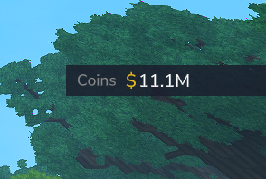

# Ecotale - Economy Plugin for Hytale

A complete economy system plugin for Hytale servers with persistent storage, customizable HUD, and multi-language support.


## Screenshots

### Balance HUD
On-screen balance display with smart formatting (K, M, B)



### Admin Panel
Complete economy management GUI with Dashboard, Players, Top, Log, and Config tabs


### Configuration
Real-time config editing with multi-language support


### Pay GUI
Player-to-player payment interface


## Features

### Core Economy
- **Player Balances** - Persistent balance storage with H2/MySQL database
- **Transfers** - Player-to-player payments with configurable fees
- **Admin Controls** - Full economy management GUI

### User Interface
- **Balance HUD** - On-screen balance display with smart formatting (K, M, B)
- **Admin Panel** - Complete GUI with tabs for Dashboard, Players, Top, Log, Config
- **Multi-language** - 6 languages: English, Spanish, Portuguese, French, German, Russian

### Technical
- **Thread-safe** - Per-player locking for atomic operations
- **Multiple Storage Options** - H2 (default), JSON, or MySQL for shared databases
- **API** - Public API for other plugins with rate limiting
- **Events** - Cancellable events for balance changes and transactions
- **All-in-one JAR** - No external dependencies required

## Installation

1. Download `Ecotale-1.0.0.jar`
2. Place in your Hytale `mods/` folder
3. Restart server

## Commands

| Command | Description | Permission |
|---------|-------------|------------|
| `/balance` | View your balance | Everyone |
| `/pay <player> <amount>` | Send money to another player | Everyone |
| `/eco` | Open admin panel GUI | Admin |
| `/eco give <player> <amount>` | Give money | Admin |
| `/eco take <player> <amount>` | Take money | Admin |
| `/eco set <player> <amount>` | Set balance | Admin |
| `/eco reset <player>` | Reset to starting balance | Admin |

## Configuration

Located in `mods/michiweon_Ecotale/Ecotale.json`:

```json
{
  "CurrencySymbol": "$",
  "CurrencyName": "Coins",
  "StartingBalance": 100.0,
  "MaxBalance": 1000000000.0,
  "TransferFee": 0.05,
  "DecimalPlaces": 2,
  "EnableHudDisplay": true,
  "Language": "en-US",
  "StorageProvider": "h2"
}
```

### Storage Providers

| Provider | Use Case |
|----------|----------|
| `h2` | Default, single server, fastest |
| `json` | Human-readable files, debugging |
| `mysql` | Shared database across servers |

## Supported Languages

| Code | Language |
|------|----------|
| en-US | English |
| es-ES | Espanol |
| pt-BR | Portugues |
| fr-FR | Francais |
| de-DE | Deutsch |
| ru-RU | Russian |


## Building from Source

```bash
./gradlew shadowJar
```

Output: `build/libs/Ecotale-1.0.0.jar`

## API Usage

```java
import com.ecotale.api.EcotaleAPI;

// Get balance
double balance = EcotaleAPI.getBalance(playerUuid);

// Deposit/Withdraw
EcotaleAPI.deposit(playerUuid, 100.0, "Quest reward");
EcotaleAPI.withdraw(playerUuid, 50.0, "Shop purchase");

// Transfer
EcotaleAPI.transfer(fromUuid, toUuid, 100.0, "Trade");
```

See [docs/API.md](docs/API.md) for full API documentation.

## License

MIT License - 2026 michiweon
